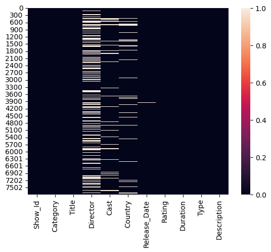
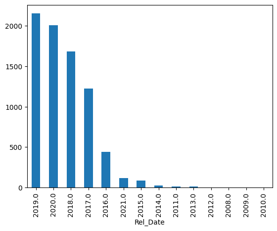
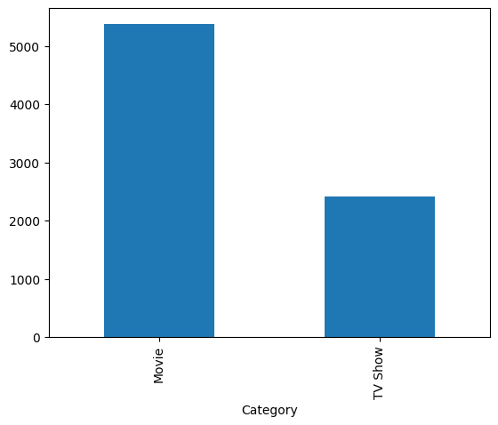

```python
# importing libraries
import numpy as np
import pandas as pd
import matplotlib.pyplot as plt
%matplotlib inline
import seaborn as sns
```


```python
# importing the dataset
df = pd.read_csv(r'D:\Avishek\realme\DA\python\Projects\Netflix EDA\8. Netflix Dataset.csv')
```

# Exploratory Data Analysis (EDA)


```python
df
```


<div>
<style scoped>
    .dataframe tbody tr th:only-of-type {
        vertical-align: middle;
    }

    .dataframe tbody tr th {
        vertical-align: top;
    }

    .dataframe thead th {
        text-align: right;
    }
</style>
<table border="1" class="dataframe">
  <thead>
    <tr style="text-align: right;">
      <th></th>
      <th>Show_Id</th>
      <th>Category</th>
      <th>Title</th>
      <th>Director</th>
      <th>Cast</th>
      <th>Country</th>
      <th>Release_Date</th>
      <th>Rating</th>
      <th>Duration</th>
      <th>Type</th>
      <th>Description</th>
    </tr>
  </thead>
  <tbody>
    <tr>
      <th>0</th>
      <td>s1</td>
      <td>TV Show</td>
      <td>3%</td>
      <td>NaN</td>
      <td>João Miguel, Bianca Comparato, Michel Gomes, ...</td>
      <td>Brazil</td>
      <td>August 14, 2020</td>
      <td>TV-MA</td>
      <td>4 Seasons</td>
      <td>International TV Shows, TV Dramas, TV Sci-Fi &amp;...</td>
      <td>In a future where the elite inhabit an island ...</td>
    </tr>
    <tr>
      <th>1</th>
      <td>s2</td>
      <td>Movie</td>
      <td>07:19</td>
      <td>Jorge Michel Grau</td>
      <td>Demián Bichir, Héctor Bonilla, Oscar Serrano...</td>
      <td>Mexico</td>
      <td>December 23, 2016</td>
      <td>TV-MA</td>
      <td>93 min</td>
      <td>Dramas, International Movies</td>
      <td>After a devastating earthquake hits Mexico Cit...</td>
    </tr>
    <tr>
      <th>2</th>
      <td>s3</td>
      <td>Movie</td>
      <td>23:59</td>
      <td>Gilbert Chan</td>
      <td>Tedd Chan, Stella Chung, Henley Hii, Lawrence ...</td>
      <td>Singapore</td>
      <td>December 20, 2018</td>
      <td>R</td>
      <td>78 min</td>
      <td>Horror Movies, International Movies</td>
      <td>When an army recruit is found dead, his fellow...</td>
    </tr>
    <tr>
      <th>3</th>
      <td>s4</td>
      <td>Movie</td>
      <td>9</td>
      <td>Shane Acker</td>
      <td>Elijah Wood, John C. Reilly, Jennifer Connelly...</td>
      <td>United States</td>
      <td>November 16, 2017</td>
      <td>PG-13</td>
      <td>80 min</td>
      <td>Action &amp; Adventure, Independent Movies, Sci-Fi...</td>
      <td>In a postapocalyptic world, rag-doll robots hi...</td>
    </tr>
    <tr>
      <th>4</th>
      <td>s5</td>
      <td>Movie</td>
      <td>21</td>
      <td>Robert Luketic</td>
      <td>Jim Sturgess, Kevin Spacey, Kate Bosworth, Aar...</td>
      <td>United States</td>
      <td>January 1, 2020</td>
      <td>PG-13</td>
      <td>123 min</td>
      <td>Dramas</td>
      <td>A brilliant group of students become card-coun...</td>
    </tr>
    <tr>
      <th>...</th>
      <td>...</td>
      <td>...</td>
      <td>...</td>
      <td>...</td>
      <td>...</td>
      <td>...</td>
      <td>...</td>
      <td>...</td>
      <td>...</td>
      <td>...</td>
      <td>...</td>
    </tr>
    <tr>
      <th>7784</th>
      <td>s7783</td>
      <td>Movie</td>
      <td>Zozo</td>
      <td>Josef Fares</td>
      <td>Imad Creidi, Antoinette Turk, Elias Gergi, Car...</td>
      <td>Sweden, Czech Republic, United Kingdom, Denmar...</td>
      <td>October 19, 2020</td>
      <td>TV-MA</td>
      <td>99 min</td>
      <td>Dramas, International Movies</td>
      <td>When Lebanon's Civil War deprives Zozo of his ...</td>
    </tr>
    <tr>
      <th>7785</th>
      <td>s7784</td>
      <td>Movie</td>
      <td>Zubaan</td>
      <td>Mozez Singh</td>
      <td>Vicky Kaushal, Sarah-Jane Dias, Raaghav Chanan...</td>
      <td>India</td>
      <td>March 2, 2019</td>
      <td>TV-14</td>
      <td>111 min</td>
      <td>Dramas, International Movies, Music &amp; Musicals</td>
      <td>A scrappy but poor boy worms his way into a ty...</td>
    </tr>
    <tr>
      <th>7786</th>
      <td>s7785</td>
      <td>Movie</td>
      <td>Zulu Man in Japan</td>
      <td>NaN</td>
      <td>Nasty C</td>
      <td>NaN</td>
      <td>September 25, 2020</td>
      <td>TV-MA</td>
      <td>44 min</td>
      <td>Documentaries, International Movies, Music &amp; M...</td>
      <td>In this documentary, South African rapper Nast...</td>
    </tr>
    <tr>
      <th>7787</th>
      <td>s7786</td>
      <td>TV Show</td>
      <td>Zumbo's Just Desserts</td>
      <td>NaN</td>
      <td>Adriano Zumbo, Rachel Khoo</td>
      <td>Australia</td>
      <td>October 31, 2020</td>
      <td>TV-PG</td>
      <td>1 Season</td>
      <td>International TV Shows, Reality TV</td>
      <td>Dessert wizard Adriano Zumbo looks for the nex...</td>
    </tr>
    <tr>
      <th>7788</th>
      <td>s7787</td>
      <td>Movie</td>
      <td>ZZ TOP: THAT LITTLE OL' BAND FROM TEXAS</td>
      <td>Sam Dunn</td>
      <td>NaN</td>
      <td>United Kingdom, Canada, United States</td>
      <td>March 1, 2020</td>
      <td>TV-MA</td>
      <td>90 min</td>
      <td>Documentaries, Music &amp; Musicals</td>
      <td>This documentary delves into the mystique behi...</td>
    </tr>
  </tbody>
</table>
<p>7789 rows × 11 columns</p>
</div>


```python
df.head(5)
```


<div>
<style scoped>
    .dataframe tbody tr th:only-of-type {
        vertical-align: middle;
    }

    .dataframe tbody tr th {
        vertical-align: top;
    }

    .dataframe thead th {
        text-align: right;
    }
</style>
<table border="1" class="dataframe">
  <thead>
    <tr style="text-align: right;">
      <th></th>
      <th>Show_Id</th>
      <th>Category</th>
      <th>Title</th>
      <th>Director</th>
      <th>Cast</th>
      <th>Country</th>
      <th>Release_Date</th>
      <th>Rating</th>
      <th>Duration</th>
      <th>Type</th>
      <th>Description</th>
    </tr>
  </thead>
  <tbody>
    <tr>
      <th>0</th>
      <td>s1</td>
      <td>TV Show</td>
      <td>3%</td>
      <td>NaN</td>
      <td>João Miguel, Bianca Comparato, Michel Gomes, ...</td>
      <td>Brazil</td>
      <td>August 14, 2020</td>
      <td>TV-MA</td>
      <td>4 Seasons</td>
      <td>International TV Shows, TV Dramas, TV Sci-Fi &amp;...</td>
      <td>In a future where the elite inhabit an island ...</td>
    </tr>
    <tr>
      <th>1</th>
      <td>s2</td>
      <td>Movie</td>
      <td>07:19</td>
      <td>Jorge Michel Grau</td>
      <td>Demián Bichir, Héctor Bonilla, Oscar Serrano...</td>
      <td>Mexico</td>
      <td>December 23, 2016</td>
      <td>TV-MA</td>
      <td>93 min</td>
      <td>Dramas, International Movies</td>
      <td>After a devastating earthquake hits Mexico Cit...</td>
    </tr>
    <tr>
      <th>2</th>
      <td>s3</td>
      <td>Movie</td>
      <td>23:59</td>
      <td>Gilbert Chan</td>
      <td>Tedd Chan, Stella Chung, Henley Hii, Lawrence ...</td>
      <td>Singapore</td>
      <td>December 20, 2018</td>
      <td>R</td>
      <td>78 min</td>
      <td>Horror Movies, International Movies</td>
      <td>When an army recruit is found dead, his fellow...</td>
    </tr>
    <tr>
      <th>3</th>
      <td>s4</td>
      <td>Movie</td>
      <td>9</td>
      <td>Shane Acker</td>
      <td>Elijah Wood, John C. Reilly, Jennifer Connelly...</td>
      <td>United States</td>
      <td>November 16, 2017</td>
      <td>PG-13</td>
      <td>80 min</td>
      <td>Action &amp; Adventure, Independent Movies, Sci-Fi...</td>
      <td>In a postapocalyptic world, rag-doll robots hi...</td>
    </tr>
    <tr>
      <th>4</th>
      <td>s5</td>
      <td>Movie</td>
      <td>21</td>
      <td>Robert Luketic</td>
      <td>Jim Sturgess, Kevin Spacey, Kate Bosworth, Aar...</td>
      <td>United States</td>
      <td>January 1, 2020</td>
      <td>PG-13</td>
      <td>123 min</td>
      <td>Dramas</td>
      <td>A brilliant group of students become card-coun...</td>
    </tr>
  </tbody>
</table>
</div>


```python
df.tail()
```


<div>
<style scoped>
    .dataframe tbody tr th:only-of-type {
        vertical-align: middle;
    }

    .dataframe tbody tr th {
        vertical-align: top;
    }

    .dataframe thead th {
        text-align: right;
    }
</style>
<table border="1" class="dataframe">
  <thead>
    <tr style="text-align: right;">
      <th></th>
      <th>Show_Id</th>
      <th>Category</th>
      <th>Title</th>
      <th>Director</th>
      <th>Cast</th>
      <th>Country</th>
      <th>Release_Date</th>
      <th>Rating</th>
      <th>Duration</th>
      <th>Type</th>
      <th>Description</th>
    </tr>
  </thead>
  <tbody>
    <tr>
      <th>7784</th>
      <td>s7783</td>
      <td>Movie</td>
      <td>Zozo</td>
      <td>Josef Fares</td>
      <td>Imad Creidi, Antoinette Turk, Elias Gergi, Car...</td>
      <td>Sweden, Czech Republic, United Kingdom, Denmar...</td>
      <td>October 19, 2020</td>
      <td>TV-MA</td>
      <td>99 min</td>
      <td>Dramas, International Movies</td>
      <td>When Lebanon's Civil War deprives Zozo of his ...</td>
    </tr>
    <tr>
      <th>7785</th>
      <td>s7784</td>
      <td>Movie</td>
      <td>Zubaan</td>
      <td>Mozez Singh</td>
      <td>Vicky Kaushal, Sarah-Jane Dias, Raaghav Chanan...</td>
      <td>India</td>
      <td>March 2, 2019</td>
      <td>TV-14</td>
      <td>111 min</td>
      <td>Dramas, International Movies, Music &amp; Musicals</td>
      <td>A scrappy but poor boy worms his way into a ty...</td>
    </tr>
    <tr>
      <th>7786</th>
      <td>s7785</td>
      <td>Movie</td>
      <td>Zulu Man in Japan</td>
      <td>NaN</td>
      <td>Nasty C</td>
      <td>NaN</td>
      <td>September 25, 2020</td>
      <td>TV-MA</td>
      <td>44 min</td>
      <td>Documentaries, International Movies, Music &amp; M...</td>
      <td>In this documentary, South African rapper Nast...</td>
    </tr>
    <tr>
      <th>7787</th>
      <td>s7786</td>
      <td>TV Show</td>
      <td>Zumbo's Just Desserts</td>
      <td>NaN</td>
      <td>Adriano Zumbo, Rachel Khoo</td>
      <td>Australia</td>
      <td>October 31, 2020</td>
      <td>TV-PG</td>
      <td>1 Season</td>
      <td>International TV Shows, Reality TV</td>
      <td>Dessert wizard Adriano Zumbo looks for the nex...</td>
    </tr>
    <tr>
      <th>7788</th>
      <td>s7787</td>
      <td>Movie</td>
      <td>ZZ TOP: THAT LITTLE OL' BAND FROM TEXAS</td>
      <td>Sam Dunn</td>
      <td>NaN</td>
      <td>United Kingdom, Canada, United States</td>
      <td>March 1, 2020</td>
      <td>TV-MA</td>
      <td>90 min</td>
      <td>Documentaries, Music &amp; Musicals</td>
      <td>This documentary delves into the mystique behi...</td>
    </tr>
  </tbody>
</table>
</div>


```python
df.shape
```


    (7789, 11)


```python
df.size
```


    85679


```python
df.columns
```


    Index(['Show_Id', 'Category', 'Title', 'Director', 'Cast', 'Country',
           'Release_Date', 'Rating', 'Duration', 'Type', 'Description'],
          dtype='object')


```python
df.dtypes
```


    Show_Id         object
    Category        object
    Title           object
    Director        object
    Cast            object
    Country         object
    Release_Date    object
    Rating          object
    Duration        object
    Type            object
    Description     object
    dtype: object


```python
df.info
```


    <bound method DataFrame.info of      Show_Id Category                                    Title   
    0         s1  TV Show                                       3%  \
    1         s2    Movie                                    07:19   
    2         s3    Movie                                    23:59   
    3         s4    Movie                                        9   
    4         s5    Movie                                       21   
    ...      ...      ...                                      ...   
    7784   s7783    Movie                                     Zozo   
    7785   s7784    Movie                                   Zubaan   
    7786   s7785    Movie                        Zulu Man in Japan   
    7787   s7786  TV Show                    Zumbo's Just Desserts   
    7788   s7787    Movie  ZZ TOP: THAT LITTLE OL' BAND FROM TEXAS   
    
                   Director                                               Cast   
    0                   NaN  João Miguel, Bianca Comparato, Michel Gomes, ...  \
    1     Jorge Michel Grau  Demián Bichir, Héctor Bonilla, Oscar Serrano...   
    2          Gilbert Chan  Tedd Chan, Stella Chung, Henley Hii, Lawrence ...   
    3           Shane Acker  Elijah Wood, John C. Reilly, Jennifer Connelly...   
    4        Robert Luketic  Jim Sturgess, Kevin Spacey, Kate Bosworth, Aar...   
    ...                 ...                                                ...   
    7784        Josef Fares  Imad Creidi, Antoinette Turk, Elias Gergi, Car...   
    7785        Mozez Singh  Vicky Kaushal, Sarah-Jane Dias, Raaghav Chanan...   
    7786                NaN                                            Nasty C   
    7787                NaN                         Adriano Zumbo, Rachel Khoo   
    7788           Sam Dunn                                                NaN   
    
                                                    Country        Release_Date   
    0                                                Brazil     August 14, 2020  \
    1                                                Mexico   December 23, 2016   
    2                                             Singapore   December 20, 2018   
    3                                         United States   November 16, 2017   
    4                                         United States     January 1, 2020   
    ...                                                 ...                 ...   
    7784  Sweden, Czech Republic, United Kingdom, Denmar...    October 19, 2020   
    7785                                              India       March 2, 2019   
    7786                                                NaN  September 25, 2020   
    7787                                          Australia    October 31, 2020   
    7788              United Kingdom, Canada, United States       March 1, 2020   
    
         Rating   Duration                                               Type   
    0     TV-MA  4 Seasons  International TV Shows, TV Dramas, TV Sci-Fi &...  \
    1     TV-MA     93 min                       Dramas, International Movies   
    2         R     78 min                Horror Movies, International Movies   
    3     PG-13     80 min  Action & Adventure, Independent Movies, Sci-Fi...   
    4     PG-13    123 min                                             Dramas   
    ...     ...        ...                                                ...   
    7784  TV-MA     99 min                       Dramas, International Movies   
    7785  TV-14    111 min     Dramas, International Movies, Music & Musicals   
    7786  TV-MA     44 min  Documentaries, International Movies, Music & M...   
    7787  TV-PG   1 Season                 International TV Shows, Reality TV   
    7788  TV-MA     90 min                    Documentaries, Music & Musicals   
    
                                                Description  
    0     In a future where the elite inhabit an island ...  
    1     After a devastating earthquake hits Mexico Cit...  
    2     When an army recruit is found dead, his fellow...  
    3     In a postapocalyptic world, rag-doll robots hi...  
    4     A brilliant group of students become card-coun...  
    ...                                                 ...  
    7784  When Lebanon's Civil War deprives Zozo of his ...  
    7785  A scrappy but poor boy worms his way into a ty...  
    7786  In this documentary, South African rapper Nast...  
    7787  Dessert wizard Adriano Zumbo looks for the nex...  
    7788  This documentary delves into the mystique behi...  
    
    [7789 rows x 11 columns]>


```python
df.info()
```

    <class 'pandas.core.frame.DataFrame'>
    RangeIndex: 7789 entries, 0 to 7788
    Data columns (total 11 columns):
     #   Column        Non-Null Count  Dtype 
    ---  ------        --------------  ----- 
     0   Show_Id       7789 non-null   object
     1   Category      7789 non-null   object
     2   Title         7789 non-null   object
     3   Director      5401 non-null   object
     4   Cast          7071 non-null   object
     5   Country       7282 non-null   object
     6   Release_Date  7779 non-null   object
     7   Rating        7782 non-null   object
     8   Duration      7789 non-null   object
     9   Type          7789 non-null   object
     10  Description   7789 non-null   object
    dtypes: object(11)
    memory usage: 669.5+ KB
    

---

   ### TASK 1. Is there any Duplicate Record in the dataset? If yes, then remove them.


```python
df[df.duplicated()]
```


<div>
<style scoped>
    .dataframe tbody tr th:only-of-type {
        vertical-align: middle;
    }

    .dataframe tbody tr th {
        vertical-align: top;
    }

    .dataframe thead th {
        text-align: right;
    }
</style>
<table border="1" class="dataframe">
  <thead>
    <tr style="text-align: right;">
      <th></th>
      <th>Show_Id</th>
      <th>Category</th>
      <th>Title</th>
      <th>Director</th>
      <th>Cast</th>
      <th>Country</th>
      <th>Release_Date</th>
      <th>Rating</th>
      <th>Duration</th>
      <th>Type</th>
      <th>Description</th>
    </tr>
  </thead>
  <tbody>
    <tr>
      <th>6300</th>
      <td>s684</td>
      <td>Movie</td>
      <td>Backfire</td>
      <td>Dave Patten</td>
      <td>Black Deniro, Byron "Squally" Vinson, Dominic ...</td>
      <td>United States</td>
      <td>April 5, 2019</td>
      <td>TV-MA</td>
      <td>97 min</td>
      <td>Dramas, Independent Movies, Thrillers</td>
      <td>When two would-be robbers accidentally kill a ...</td>
    </tr>
    <tr>
      <th>6622</th>
      <td>s6621</td>
      <td>Movie</td>
      <td>The Lost Okoroshi</td>
      <td>Abba T. Makama</td>
      <td>Seun Ajayi, Judith Audu, Tope Tedela, Ifu Enna...</td>
      <td>Nigeria</td>
      <td>September 4, 2020</td>
      <td>TV-MA</td>
      <td>94 min</td>
      <td>Comedies, Dramas, Independent Movies</td>
      <td>A disillusioned security guard transforms into...</td>
    </tr>
  </tbody>
</table>
</div>


```python
df.drop_duplicates(inplace = True)
```

### TASK 2. Is there any NULL value present in any column? Show with Heat-map.


```python
df.isnull()
```


<div>
<style scoped>
    .dataframe tbody tr th:only-of-type {
        vertical-align: middle;
    }

    .dataframe tbody tr th {
        vertical-align: top;
    }

    .dataframe thead th {
        text-align: right;
    }
</style>
<table border="1" class="dataframe">
  <thead>
    <tr style="text-align: right;">
      <th></th>
      <th>Show_Id</th>
      <th>Category</th>
      <th>Title</th>
      <th>Director</th>
      <th>Cast</th>
      <th>Country</th>
      <th>Release_Date</th>
      <th>Rating</th>
      <th>Duration</th>
      <th>Type</th>
      <th>Description</th>
    </tr>
  </thead>
  <tbody>
    <tr>
      <th>0</th>
      <td>False</td>
      <td>False</td>
      <td>False</td>
      <td>True</td>
      <td>False</td>
      <td>False</td>
      <td>False</td>
      <td>False</td>
      <td>False</td>
      <td>False</td>
      <td>False</td>
    </tr>
    <tr>
      <th>1</th>
      <td>False</td>
      <td>False</td>
      <td>False</td>
      <td>False</td>
      <td>False</td>
      <td>False</td>
      <td>False</td>
      <td>False</td>
      <td>False</td>
      <td>False</td>
      <td>False</td>
    </tr>
    <tr>
      <th>2</th>
      <td>False</td>
      <td>False</td>
      <td>False</td>
      <td>False</td>
      <td>False</td>
      <td>False</td>
      <td>False</td>
      <td>False</td>
      <td>False</td>
      <td>False</td>
      <td>False</td>
    </tr>
    <tr>
      <th>3</th>
      <td>False</td>
      <td>False</td>
      <td>False</td>
      <td>False</td>
      <td>False</td>
      <td>False</td>
      <td>False</td>
      <td>False</td>
      <td>False</td>
      <td>False</td>
      <td>False</td>
    </tr>
    <tr>
      <th>4</th>
      <td>False</td>
      <td>False</td>
      <td>False</td>
      <td>False</td>
      <td>False</td>
      <td>False</td>
      <td>False</td>
      <td>False</td>
      <td>False</td>
      <td>False</td>
      <td>False</td>
    </tr>
    <tr>
      <th>...</th>
      <td>...</td>
      <td>...</td>
      <td>...</td>
      <td>...</td>
      <td>...</td>
      <td>...</td>
      <td>...</td>
      <td>...</td>
      <td>...</td>
      <td>...</td>
      <td>...</td>
    </tr>
    <tr>
      <th>7784</th>
      <td>False</td>
      <td>False</td>
      <td>False</td>
      <td>False</td>
      <td>False</td>
      <td>False</td>
      <td>False</td>
      <td>False</td>
      <td>False</td>
      <td>False</td>
      <td>False</td>
    </tr>
    <tr>
      <th>7785</th>
      <td>False</td>
      <td>False</td>
      <td>False</td>
      <td>False</td>
      <td>False</td>
      <td>False</td>
      <td>False</td>
      <td>False</td>
      <td>False</td>
      <td>False</td>
      <td>False</td>
    </tr>
    <tr>
      <th>7786</th>
      <td>False</td>
      <td>False</td>
      <td>False</td>
      <td>True</td>
      <td>False</td>
      <td>True</td>
      <td>False</td>
      <td>False</td>
      <td>False</td>
      <td>False</td>
      <td>False</td>
    </tr>
    <tr>
      <th>7787</th>
      <td>False</td>
      <td>False</td>
      <td>False</td>
      <td>True</td>
      <td>False</td>
      <td>False</td>
      <td>False</td>
      <td>False</td>
      <td>False</td>
      <td>False</td>
      <td>False</td>
    </tr>
    <tr>
      <th>7788</th>
      <td>False</td>
      <td>False</td>
      <td>False</td>
      <td>False</td>
      <td>True</td>
      <td>False</td>
      <td>False</td>
      <td>False</td>
      <td>False</td>
      <td>False</td>
      <td>False</td>
    </tr>
  </tbody>
</table>
<p>7787 rows × 11 columns</p>
</div>


```python
df.isnull().sum()
```


    Show_Id            0
    Category           0
    Title              0
    Director        2388
    Cast             718
    Country          507
    Release_Date      10
    Rating             7
    Duration           0
    Type               0
    Description        0
    dtype: int64


```python
sns.heatmap(df.isnull())
```


    <Axes: >


    

    


---

### Questions & Answers

#### Q1. For 'House of Cards', What is the Show Id and who is the Director of this show?

##### isin()


```python
df[df['Title'].isin(['House of Cards'])]
```


<div>
<style scoped>
    .dataframe tbody tr th:only-of-type {
        vertical-align: middle;
    }

    .dataframe tbody tr th {
        vertical-align: top;
    }

    .dataframe thead th {
        text-align: right;
    }
</style>
<table border="1" class="dataframe">
  <thead>
    <tr style="text-align: right;">
      <th></th>
      <th>Show_Id</th>
      <th>Category</th>
      <th>Title</th>
      <th>Director</th>
      <th>Cast</th>
      <th>Country</th>
      <th>Release_Date</th>
      <th>Rating</th>
      <th>Duration</th>
      <th>Type</th>
      <th>Description</th>
    </tr>
  </thead>
  <tbody>
    <tr>
      <th>2832</th>
      <td>s2833</td>
      <td>TV Show</td>
      <td>House of Cards</td>
      <td>Robin Wright, David Fincher, Gerald McRaney, J...</td>
      <td>Kevin Spacey, Robin Wright, Kate Mara, Corey S...</td>
      <td>United States</td>
      <td>November 2, 2018</td>
      <td>TV-MA</td>
      <td>6 Seasons</td>
      <td>TV Dramas, TV Thrillers</td>
      <td>A ruthless politician will stop at nothing to ...</td>
    </tr>
  </tbody>
</table>
</div>


##### str.contains()


```python
df[df['Title'].str.contains('House of Cards')]
```


<div>
<style scoped>
    .dataframe tbody tr th:only-of-type {
        vertical-align: middle;
    }

    .dataframe tbody tr th {
        vertical-align: top;
    }

    .dataframe thead th {
        text-align: right;
    }
</style>
<table border="1" class="dataframe">
  <thead>
    <tr style="text-align: right;">
      <th></th>
      <th>Show_Id</th>
      <th>Category</th>
      <th>Title</th>
      <th>Director</th>
      <th>Cast</th>
      <th>Country</th>
      <th>Release_Date</th>
      <th>Rating</th>
      <th>Duration</th>
      <th>Type</th>
      <th>Description</th>
    </tr>
  </thead>
  <tbody>
    <tr>
      <th>2832</th>
      <td>s2833</td>
      <td>TV Show</td>
      <td>House of Cards</td>
      <td>Robin Wright, David Fincher, Gerald McRaney, J...</td>
      <td>Kevin Spacey, Robin Wright, Kate Mara, Corey S...</td>
      <td>United States</td>
      <td>November 2, 2018</td>
      <td>TV-MA</td>
      <td>6 Seasons</td>
      <td>TV Dramas, TV Thrillers</td>
      <td>A ruthless politician will stop at nothing to ...</td>
    </tr>
  </tbody>
</table>
</div>


---

##### Q2. In which year the highest no. of TV Shows and Movies were released? Show with Bar Graph.


```python
df.dtypes   #checking data types   
```


    Show_Id         object
    Category        object
    Title           object
    Director        object
    Cast            object
    Country         object
    Release_Date    object
    Rating          object
    Duration        object
    Type            object
    Description     object
    dtype: object


```python
df['Rel_Date'] = pd.to_datetime(df['Release_Date'], format = 'mixed')  #Creating new column to store date in datetime format
```


```python
df.head()
```


<div>
<style scoped>
    .dataframe tbody tr th:only-of-type {
        vertical-align: middle;
    }

    .dataframe tbody tr th {
        vertical-align: top;
    }

    .dataframe thead th {
        text-align: right;
    }
</style>
<table border="1" class="dataframe">
  <thead>
    <tr style="text-align: right;">
      <th></th>
      <th>Show_Id</th>
      <th>Category</th>
      <th>Title</th>
      <th>Director</th>
      <th>Cast</th>
      <th>Country</th>
      <th>Release_Date</th>
      <th>Rating</th>
      <th>Duration</th>
      <th>Type</th>
      <th>Description</th>
      <th>Rel_Date</th>
    </tr>
  </thead>
  <tbody>
    <tr>
      <th>0</th>
      <td>s1</td>
      <td>TV Show</td>
      <td>3%</td>
      <td>NaN</td>
      <td>João Miguel, Bianca Comparato, Michel Gomes, ...</td>
      <td>Brazil</td>
      <td>August 14, 2020</td>
      <td>TV-MA</td>
      <td>4 Seasons</td>
      <td>International TV Shows, TV Dramas, TV Sci-Fi &amp;...</td>
      <td>In a future where the elite inhabit an island ...</td>
      <td>2020-08-14</td>
    </tr>
    <tr>
      <th>1</th>
      <td>s2</td>
      <td>Movie</td>
      <td>07:19</td>
      <td>Jorge Michel Grau</td>
      <td>Demián Bichir, Héctor Bonilla, Oscar Serrano...</td>
      <td>Mexico</td>
      <td>December 23, 2016</td>
      <td>TV-MA</td>
      <td>93 min</td>
      <td>Dramas, International Movies</td>
      <td>After a devastating earthquake hits Mexico Cit...</td>
      <td>2016-12-23</td>
    </tr>
    <tr>
      <th>2</th>
      <td>s3</td>
      <td>Movie</td>
      <td>23:59</td>
      <td>Gilbert Chan</td>
      <td>Tedd Chan, Stella Chung, Henley Hii, Lawrence ...</td>
      <td>Singapore</td>
      <td>December 20, 2018</td>
      <td>R</td>
      <td>78 min</td>
      <td>Horror Movies, International Movies</td>
      <td>When an army recruit is found dead, his fellow...</td>
      <td>2018-12-20</td>
    </tr>
    <tr>
      <th>3</th>
      <td>s4</td>
      <td>Movie</td>
      <td>9</td>
      <td>Shane Acker</td>
      <td>Elijah Wood, John C. Reilly, Jennifer Connelly...</td>
      <td>United States</td>
      <td>November 16, 2017</td>
      <td>PG-13</td>
      <td>80 min</td>
      <td>Action &amp; Adventure, Independent Movies, Sci-Fi...</td>
      <td>In a postapocalyptic world, rag-doll robots hi...</td>
      <td>2017-11-16</td>
    </tr>
    <tr>
      <th>4</th>
      <td>s5</td>
      <td>Movie</td>
      <td>21</td>
      <td>Robert Luketic</td>
      <td>Jim Sturgess, Kevin Spacey, Kate Bosworth, Aar...</td>
      <td>United States</td>
      <td>January 1, 2020</td>
      <td>PG-13</td>
      <td>123 min</td>
      <td>Dramas</td>
      <td>A brilliant group of students become card-coun...</td>
      <td>2020-01-01</td>
    </tr>
  </tbody>
</table>
</div>


```python
df['Rel_Date'].dt.year.value_counts()    #counts the occurence of each year
```


    Rel_Date
    2019.0    2153
    2020.0    2009
    2018.0    1685
    2017.0    1225
    2016.0     443
    2021.0     117
    2015.0      88
    2014.0      25
    2011.0      13
    2013.0      11
    2012.0       3
    2008.0       2
    2009.0       2
    2010.0       1
    Name: count, dtype: int64


```python
df['Rel_Date'].dt.year.value_counts().plot(kind = 'bar')
```


    <Axes: xlabel='Rel_Date'>


    

    


---

##### Q3. How many Movies and TV Show are in the dataset? Show with the Bar Gaph.


```python
df.groupby('Category').Category.count()      #to group all unique items of a column
```


    Category
    Movie      5377
    TV Show    2410
    Name: Category, dtype: int64


```python
df.groupby('Category').Category.count().plot(kind = 'bar')      #to group all unique items of a column
```


    <Axes: xlabel='Category'>


    

    


##### countplot()


```python
sns.countplot(df['Category'])
```


    ---------------------------------------------------------------------------

    ValueError                                Traceback (most recent call last)

    Cell In[40], line 1
    ----> 1 sns.countplot(df['Category'])
    

    File ~\AppData\Roaming\Python\Python38\site-packages\seaborn\categorical.py:2943, in countplot(data, x, y, hue, order, hue_order, orient, color, palette, saturation, width, dodge, ax, **kwargs)
       2940 elif x is not None and y is not None:
       2941     raise ValueError("Cannot pass values for both `x` and `y`")
    -> 2943 plotter = _CountPlotter(
       2944     x, y, hue, data, order, hue_order,
       2945     estimator, errorbar, n_boot, units, seed,
       2946     orient, color, palette, saturation,
       2947     width, errcolor, errwidth, capsize, dodge
       2948 )
       2950 plotter.value_label = "count"
       2952 if ax is None:
    

    File ~\AppData\Roaming\Python\Python38\site-packages\seaborn\categorical.py:1530, in _BarPlotter.__init__(self, x, y, hue, data, order, hue_order, estimator, errorbar, n_boot, units, seed, orient, color, palette, saturation, width, errcolor, errwidth, capsize, dodge)
       1525 def __init__(self, x, y, hue, data, order, hue_order,
       1526              estimator, errorbar, n_boot, units, seed,
       1527              orient, color, palette, saturation, width,
       1528              errcolor, errwidth, capsize, dodge):
       1529     """Initialize the plotter."""
    -> 1530     self.establish_variables(x, y, hue, data, orient,
       1531                              order, hue_order, units)
       1532     self.establish_colors(color, palette, saturation)
       1533     self.estimate_statistic(estimator, errorbar, n_boot, seed)
    

    File ~\AppData\Roaming\Python\Python38\site-packages\seaborn\categorical.py:516, in _CategoricalPlotter.establish_variables(self, x, y, hue, data, orient, order, hue_order, units)
        513     plot_data = data
        515 # Convert to a list of arrays, the common representation
    --> 516 plot_data = [np.asarray(d, float) for d in plot_data]
        518 # The group names will just be numeric indices
        519 group_names = list(range(len(plot_data)))
    

    File ~\AppData\Roaming\Python\Python38\site-packages\seaborn\categorical.py:516, in <listcomp>(.0)
        513     plot_data = data
        515 # Convert to a list of arrays, the common representation
    --> 516 plot_data = [np.asarray(d, float) for d in plot_data]
        518 # The group names will just be numeric indices
        519 group_names = list(range(len(plot_data)))
    

    File ~\AppData\Roaming\Python\Python38\site-packages\pandas\core\series.py:917, in Series.__array__(self, dtype)
        870 """
        871 Return the values as a NumPy array.
        872 
       (...)
        914       dtype='datetime64[ns]')
        915 """
        916 values = self._values
    --> 917 arr = np.asarray(values, dtype=dtype)
        918 if using_copy_on_write() and astype_is_view(values.dtype, arr.dtype):
        919     arr = arr.view()
    

    ValueError: could not convert string to float: 'TV Show'


---

##### Q4. Show all the Movies that were released in the year 2020.


```python
df['Year'] = df['Rel_Date'].dt.year
```


```python
df.head()
```


<div>
<style scoped>
    .dataframe tbody tr th:only-of-type {
        vertical-align: middle;
    }

    .dataframe tbody tr th {
        vertical-align: top;
    }

    .dataframe thead th {
        text-align: right;
    }
</style>
<table border="1" class="dataframe">
  <thead>
    <tr style="text-align: right;">
      <th></th>
      <th>Show_Id</th>
      <th>Category</th>
      <th>Title</th>
      <th>Director</th>
      <th>Cast</th>
      <th>Country</th>
      <th>Release_Date</th>
      <th>Rating</th>
      <th>Duration</th>
      <th>Type</th>
      <th>Description</th>
      <th>Rel_Date</th>
      <th>Year</th>
      <th>Length</th>
      <th>Unit</th>
    </tr>
  </thead>
  <tbody>
    <tr>
      <th>0</th>
      <td>s1</td>
      <td>TV Show</td>
      <td>3%</td>
      <td>NaN</td>
      <td>João Miguel, Bianca Comparato, Michel Gomes, ...</td>
      <td>Brazil</td>
      <td>August 14, 2020</td>
      <td>TV-MA</td>
      <td>4 Seasons</td>
      <td>International TV Shows, TV Dramas, TV Sci-Fi &amp;...</td>
      <td>In a future where the elite inhabit an island ...</td>
      <td>2020-08-14</td>
      <td>2020.0</td>
      <td>4</td>
      <td>Seasons</td>
    </tr>
    <tr>
      <th>1</th>
      <td>s2</td>
      <td>Movie</td>
      <td>07:19</td>
      <td>Jorge Michel Grau</td>
      <td>Demián Bichir, Héctor Bonilla, Oscar Serrano...</td>
      <td>Mexico</td>
      <td>December 23, 2016</td>
      <td>TV-MA</td>
      <td>93 min</td>
      <td>Dramas, International Movies</td>
      <td>After a devastating earthquake hits Mexico Cit...</td>
      <td>2016-12-23</td>
      <td>2016.0</td>
      <td>93</td>
      <td>min</td>
    </tr>
    <tr>
      <th>2</th>
      <td>s3</td>
      <td>Movie</td>
      <td>23:59</td>
      <td>Gilbert Chan</td>
      <td>Tedd Chan, Stella Chung, Henley Hii, Lawrence ...</td>
      <td>Singapore</td>
      <td>December 20, 2018</td>
      <td>R</td>
      <td>78 min</td>
      <td>Horror Movies, International Movies</td>
      <td>When an army recruit is found dead, his fellow...</td>
      <td>2018-12-20</td>
      <td>2018.0</td>
      <td>78</td>
      <td>min</td>
    </tr>
    <tr>
      <th>3</th>
      <td>s4</td>
      <td>Movie</td>
      <td>9</td>
      <td>Shane Acker</td>
      <td>Elijah Wood, John C. Reilly, Jennifer Connelly...</td>
      <td>United States</td>
      <td>November 16, 2017</td>
      <td>PG-13</td>
      <td>80 min</td>
      <td>Action &amp; Adventure, Independent Movies, Sci-Fi...</td>
      <td>In a postapocalyptic world, rag-doll robots hi...</td>
      <td>2017-11-16</td>
      <td>2017.0</td>
      <td>80</td>
      <td>min</td>
    </tr>
    <tr>
      <th>4</th>
      <td>s5</td>
      <td>Movie</td>
      <td>21</td>
      <td>Robert Luketic</td>
      <td>Jim Sturgess, Kevin Spacey, Kate Bosworth, Aar...</td>
      <td>United States</td>
      <td>January 1, 2020</td>
      <td>PG-13</td>
      <td>123 min</td>
      <td>Dramas</td>
      <td>A brilliant group of students become card-coun...</td>
      <td>2020-01-01</td>
      <td>2020.0</td>
      <td>123</td>
      <td>min</td>
    </tr>
  </tbody>
</table>
</div>


```python
df[(df['Category'] == 'Movie') & (df['Year'] == 2020)]
```


<div>
<style scoped>
    .dataframe tbody tr th:only-of-type {
        vertical-align: middle;
    }

    .dataframe tbody tr th {
        vertical-align: top;
    }

    .dataframe thead th {
        text-align: right;
    }
</style>
<table border="1" class="dataframe">
  <thead>
    <tr style="text-align: right;">
      <th></th>
      <th>Show_Id</th>
      <th>Category</th>
      <th>Title</th>
      <th>Director</th>
      <th>Cast</th>
      <th>Country</th>
      <th>Release_Date</th>
      <th>Rating</th>
      <th>Duration</th>
      <th>Type</th>
      <th>Description</th>
      <th>Rel_Date</th>
      <th>Year</th>
    </tr>
  </thead>
  <tbody>
    <tr>
      <th>4</th>
      <td>s5</td>
      <td>Movie</td>
      <td>21</td>
      <td>Robert Luketic</td>
      <td>Jim Sturgess, Kevin Spacey, Kate Bosworth, Aar...</td>
      <td>United States</td>
      <td>January 1, 2020</td>
      <td>PG-13</td>
      <td>123 min</td>
      <td>Dramas</td>
      <td>A brilliant group of students become card-coun...</td>
      <td>2020-01-01</td>
      <td>2020.0</td>
    </tr>
    <tr>
      <th>6</th>
      <td>s7</td>
      <td>Movie</td>
      <td>122</td>
      <td>Yasir Al Yasiri</td>
      <td>Amina Khalil, Ahmed Dawood, Tarek Lotfy, Ahmed...</td>
      <td>Egypt</td>
      <td>June 1, 2020</td>
      <td>TV-MA</td>
      <td>95 min</td>
      <td>Horror Movies, International Movies</td>
      <td>After an awful accident, a couple admitted to ...</td>
      <td>2020-06-01</td>
      <td>2020.0</td>
    </tr>
    <tr>
      <th>14</th>
      <td>s15</td>
      <td>Movie</td>
      <td>3022</td>
      <td>John Suits</td>
      <td>Omar Epps, Kate Walsh, Miranda Cosgrove, Angus...</td>
      <td>United States</td>
      <td>March 19, 2020</td>
      <td>R</td>
      <td>91 min</td>
      <td>Independent Movies, Sci-Fi &amp; Fantasy, Thrillers</td>
      <td>Stranded when the Earth is suddenly destroyed ...</td>
      <td>2020-03-19</td>
      <td>2020.0</td>
    </tr>
    <tr>
      <th>27</th>
      <td>s28</td>
      <td>Movie</td>
      <td>#Alive</td>
      <td>Cho Il</td>
      <td>Yoo Ah-in, Park Shin-hye</td>
      <td>South Korea</td>
      <td>September 8, 2020</td>
      <td>TV-MA</td>
      <td>99 min</td>
      <td>Horror Movies, International Movies, Thrillers</td>
      <td>As a grisly virus rampages a city, a lone man ...</td>
      <td>2020-09-08</td>
      <td>2020.0</td>
    </tr>
    <tr>
      <th>28</th>
      <td>s29</td>
      <td>Movie</td>
      <td>#AnneFrank - Parallel Stories</td>
      <td>Sabina Fedeli, Anna Migotto</td>
      <td>Helen Mirren, Gengher Gatti</td>
      <td>Italy</td>
      <td>July 1, 2020</td>
      <td>TV-14</td>
      <td>95 min</td>
      <td>Documentaries, International Movies</td>
      <td>Through her diary, Anne Frank's story is retol...</td>
      <td>2020-07-01</td>
      <td>2020.0</td>
    </tr>
    <tr>
      <th>...</th>
      <td>...</td>
      <td>...</td>
      <td>...</td>
      <td>...</td>
      <td>...</td>
      <td>...</td>
      <td>...</td>
      <td>...</td>
      <td>...</td>
      <td>...</td>
      <td>...</td>
      <td>...</td>
      <td>...</td>
    </tr>
    <tr>
      <th>7762</th>
      <td>s7761</td>
      <td>Movie</td>
      <td>Zaki Chan</td>
      <td>Wael Ihsan</td>
      <td>Ahmed Helmy, Yasmin Abdulaziz, Hassan Hosny, H...</td>
      <td>Egypt</td>
      <td>May 19, 2020</td>
      <td>TV-PG</td>
      <td>109 min</td>
      <td>Comedies, International Movies, Romantic Movies</td>
      <td>An unqualified young man has his work cut out ...</td>
      <td>2020-05-19</td>
      <td>2020.0</td>
    </tr>
    <tr>
      <th>7783</th>
      <td>s7782</td>
      <td>Movie</td>
      <td>Zoom</td>
      <td>Peter Hewitt</td>
      <td>Tim Allen, Courteney Cox, Chevy Chase, Kate Ma...</td>
      <td>United States</td>
      <td>January 11, 2020</td>
      <td>PG</td>
      <td>88 min</td>
      <td>Children &amp; Family Movies, Comedies</td>
      <td>Dragged from civilian life, a former superhero...</td>
      <td>2020-01-11</td>
      <td>2020.0</td>
    </tr>
    <tr>
      <th>7784</th>
      <td>s7783</td>
      <td>Movie</td>
      <td>Zozo</td>
      <td>Josef Fares</td>
      <td>Imad Creidi, Antoinette Turk, Elias Gergi, Car...</td>
      <td>Sweden, Czech Republic, United Kingdom, Denmar...</td>
      <td>October 19, 2020</td>
      <td>TV-MA</td>
      <td>99 min</td>
      <td>Dramas, International Movies</td>
      <td>When Lebanon's Civil War deprives Zozo of his ...</td>
      <td>2020-10-19</td>
      <td>2020.0</td>
    </tr>
    <tr>
      <th>7786</th>
      <td>s7785</td>
      <td>Movie</td>
      <td>Zulu Man in Japan</td>
      <td>NaN</td>
      <td>Nasty C</td>
      <td>NaN</td>
      <td>September 25, 2020</td>
      <td>TV-MA</td>
      <td>44 min</td>
      <td>Documentaries, International Movies, Music &amp; M...</td>
      <td>In this documentary, South African rapper Nast...</td>
      <td>2020-09-25</td>
      <td>2020.0</td>
    </tr>
    <tr>
      <th>7788</th>
      <td>s7787</td>
      <td>Movie</td>
      <td>ZZ TOP: THAT LITTLE OL' BAND FROM TEXAS</td>
      <td>Sam Dunn</td>
      <td>NaN</td>
      <td>United Kingdom, Canada, United States</td>
      <td>March 1, 2020</td>
      <td>TV-MA</td>
      <td>90 min</td>
      <td>Documentaries, Music &amp; Musicals</td>
      <td>This documentary delves into the mystique behi...</td>
      <td>2020-03-01</td>
      <td>2020.0</td>
    </tr>
  </tbody>
</table>
<p>1312 rows × 13 columns</p>
</div>


---

##### Q5. Show only the Title of all TV Shows that were released in India only. 


```python
df.columns
```


    Index(['Show_Id', 'Category', 'Title', 'Director', 'Cast', 'Country',
           'Release_Date', 'Rating', 'Duration', 'Type', 'Description', 'Rel_Date',
           'Year'],
          dtype='object')


```python
df[(df['Category'] == 'TV Show') & (df['Country'] == 'India')] ['Title']
```


    86            21 Sarfarosh: Saragarhi 1897
    132                              7 (Seven)
    340                           Agent Raghav
    364                          Akbar Birbal
    533                    Anjaan: Rural Myths
                           ...                
    6249                  The Creative Indians
    6400    The Golden Years with Javed Akhtar
    6469                The House That Made Me
    7294                            Typewriter
    7705                       Yeh Meri Family
    Name: Title, Length: 71, dtype: object


---

##### Q6. Show Top 10 Directors, who gave the highest no. of TV Shows & Movies to Netflix.


```python
df['Director'].value_counts().head(10)
```


    Director
    Raúl Campos, Jan Suter    18
    Marcus Raboy               16
    Jay Karas                  14
    Cathy Garcia-Molina        13
    Jay Chapman                12
    Youssef Chahine            12
    Martin Scorsese            12
    Steven Spielberg           10
    David Dhawan                9
    Hakan Algül                8
    Name: count, dtype: int64


---

##### Q7. Show all the Records, where "Category is Movie" and "Type is Comedies" or "Country is United Kingdom".


```python
df[(df['Category'] == 'Movie') & (df['Type'] == 'Comedies') | (df['Country'] == 'United Kingdom')]
```


<div>
<style scoped>
    .dataframe tbody tr th:only-of-type {
        vertical-align: middle;
    }

    .dataframe tbody tr th {
        vertical-align: top;
    }

    .dataframe thead th {
        text-align: right;
    }
</style>
<table border="1" class="dataframe">
  <thead>
    <tr style="text-align: right;">
      <th></th>
      <th>Show_Id</th>
      <th>Category</th>
      <th>Title</th>
      <th>Director</th>
      <th>Cast</th>
      <th>Country</th>
      <th>Release_Date</th>
      <th>Rating</th>
      <th>Duration</th>
      <th>Type</th>
      <th>Description</th>
      <th>Rel_Date</th>
      <th>Year</th>
    </tr>
  </thead>
  <tbody>
    <tr>
      <th>19</th>
      <td>s20</td>
      <td>Movie</td>
      <td>'89</td>
      <td>NaN</td>
      <td>Lee Dixon, Ian Wright, Paul Merson</td>
      <td>United Kingdom</td>
      <td>May 16, 2018</td>
      <td>TV-PG</td>
      <td>87 min</td>
      <td>Sports Movies</td>
      <td>Mixing old footage with interviews, this is th...</td>
      <td>2018-05-16</td>
      <td>2018.0</td>
    </tr>
    <tr>
      <th>33</th>
      <td>s34</td>
      <td>Movie</td>
      <td>#realityhigh</td>
      <td>Fernando Lebrija</td>
      <td>Nesta Cooper, Kate Walsh, John Michael Higgins...</td>
      <td>United States</td>
      <td>September 8, 2017</td>
      <td>TV-14</td>
      <td>99 min</td>
      <td>Comedies</td>
      <td>When nerdy high schooler Dani finally attracts...</td>
      <td>2017-09-08</td>
      <td>2017.0</td>
    </tr>
    <tr>
      <th>58</th>
      <td>s59</td>
      <td>TV Show</td>
      <td>100% Hotter</td>
      <td>NaN</td>
      <td>Daniel Palmer, Melissa Sophia, Karen Williams,...</td>
      <td>United Kingdom</td>
      <td>November 1, 2019</td>
      <td>TV-14</td>
      <td>1 Season</td>
      <td>British TV Shows, International TV Shows, Real...</td>
      <td>A stylist, a hair designer and a makeup artist...</td>
      <td>2019-11-01</td>
      <td>2019.0</td>
    </tr>
    <tr>
      <th>72</th>
      <td>s73</td>
      <td>Movie</td>
      <td>17 Again</td>
      <td>Burr Steers</td>
      <td>Zac Efron, Leslie Mann, Matthew Perry, Thomas ...</td>
      <td>United States</td>
      <td>January 1, 2021</td>
      <td>PG-13</td>
      <td>102 min</td>
      <td>Comedies</td>
      <td>Nearing a midlife crisis, thirty-something Mik...</td>
      <td>2021-01-01</td>
      <td>2021.0</td>
    </tr>
    <tr>
      <th>82</th>
      <td>s83</td>
      <td>Movie</td>
      <td>2036 Origin Unknown</td>
      <td>Hasraf Dulull</td>
      <td>Katee Sackhoff, Ray Fearon, Julie Cox, Steven ...</td>
      <td>United Kingdom</td>
      <td>December 20, 2018</td>
      <td>TV-14</td>
      <td>95 min</td>
      <td>Sci-Fi &amp; Fantasy</td>
      <td>Working with an artificial intelligence to inv...</td>
      <td>2018-12-20</td>
      <td>2018.0</td>
    </tr>
    <tr>
      <th>...</th>
      <td>...</td>
      <td>...</td>
      <td>...</td>
      <td>...</td>
      <td>...</td>
      <td>...</td>
      <td>...</td>
      <td>...</td>
      <td>...</td>
      <td>...</td>
      <td>...</td>
      <td>...</td>
      <td>...</td>
    </tr>
    <tr>
      <th>7670</th>
      <td>s7669</td>
      <td>TV Show</td>
      <td>World War II in Colour</td>
      <td>NaN</td>
      <td>Robert Powell</td>
      <td>United Kingdom</td>
      <td>August 1, 2017</td>
      <td>TV-MA</td>
      <td>1 Season</td>
      <td>British TV Shows, Docuseries, International TV...</td>
      <td>Footage of the most dramatic moments from Worl...</td>
      <td>2017-08-01</td>
      <td>2017.0</td>
    </tr>
    <tr>
      <th>7671</th>
      <td>s7670</td>
      <td>TV Show</td>
      <td>World's Busiest Cities</td>
      <td>NaN</td>
      <td>Anita Rani, Ade Adepitan, Dan Snow</td>
      <td>United Kingdom</td>
      <td>February 1, 2019</td>
      <td>TV-PG</td>
      <td>1 Season</td>
      <td>British TV Shows, Docuseries</td>
      <td>From Moscow to Mexico City, three BBC journali...</td>
      <td>2019-02-01</td>
      <td>2019.0</td>
    </tr>
    <tr>
      <th>7688</th>
      <td>s7687</td>
      <td>Movie</td>
      <td>XV: Beyond the Tryline</td>
      <td>Pierre Deschamps</td>
      <td>NaN</td>
      <td>United Kingdom</td>
      <td>March 18, 2020</td>
      <td>TV-14</td>
      <td>91 min</td>
      <td>Documentaries, Sports Movies</td>
      <td>Set against the 2015 Rugby World Cup, this doc...</td>
      <td>2020-03-18</td>
      <td>2020.0</td>
    </tr>
    <tr>
      <th>7725</th>
      <td>s7724</td>
      <td>Movie</td>
      <td>You Can Tutu</td>
      <td>James Brown</td>
      <td>Lily O'Regan, Jeannettsy Enriquez Borges, Joel...</td>
      <td>United Kingdom</td>
      <td>December 31, 2017</td>
      <td>TV-G</td>
      <td>87 min</td>
      <td>Children &amp; Family Movies</td>
      <td>A gifted young ballet dancer struggles to find...</td>
      <td>2017-12-31</td>
      <td>2017.0</td>
    </tr>
    <tr>
      <th>7740</th>
      <td>s7739</td>
      <td>TV Show</td>
      <td>Young Wallander</td>
      <td>NaN</td>
      <td>Adam PÃ¥lsson, Richard Dillane, Leanne Best, E...</td>
      <td>United Kingdom</td>
      <td>September 3, 2020</td>
      <td>TV-MA</td>
      <td>1 Season</td>
      <td>Crime TV Shows, International TV Shows, TV Dramas</td>
      <td>An incendiary hate crime stirs civil unrest, f...</td>
      <td>2020-09-03</td>
      <td>2020.0</td>
    </tr>
  </tbody>
</table>
<p>485 rows × 13 columns</p>
</div>


---

##### Q8. In how many Movies/TV Shows, Tom Cruise was cast?


```python
df[df['Cast'].str.contains('Tom Cruise')]
```


    ---------------------------------------------------------------------------

    ValueError                                Traceback (most recent call last)

    Cell In[48], line 1
    ----> 1 df[df['Cast'].str.contains('Tom Cruise')]
    

    File ~\AppData\Roaming\Python\Python38\site-packages\pandas\core\frame.py:3751, in DataFrame.__getitem__(self, key)
       3748     return self.where(key)
       3750 # Do we have a (boolean) 1d indexer?
    -> 3751 if com.is_bool_indexer(key):
       3752     return self._getitem_bool_array(key)
       3754 # We are left with two options: a single key, and a collection of keys,
       3755 # We interpret tuples as collections only for non-MultiIndex
    

    File ~\AppData\Roaming\Python\Python38\site-packages\pandas\core\common.py:134, in is_bool_indexer(key)
        130     na_msg = "Cannot mask with non-boolean array containing NA / NaN values"
        131     if lib.infer_dtype(key_array) == "boolean" and isna(key_array).any():
        132         # Don't raise on e.g. ["A", "B", np.nan], see
        133         #  test_loc_getitem_list_of_labels_categoricalindex_with_na
    --> 134         raise ValueError(na_msg)
        135     return False
        136 return True
    

    ValueError: Cannot mask with non-boolean array containing NA / NaN values


```python
df2 = df.dropna()           #creating new dataframe without any NULL values from original dataframe
```


```python
df2.head(1)
```


<div>
<style scoped>
    .dataframe tbody tr th:only-of-type {
        vertical-align: middle;
    }

    .dataframe tbody tr th {
        vertical-align: top;
    }

    .dataframe thead th {
        text-align: right;
    }
</style>
<table border="1" class="dataframe">
  <thead>
    <tr style="text-align: right;">
      <th></th>
      <th>Show_Id</th>
      <th>Category</th>
      <th>Title</th>
      <th>Director</th>
      <th>Cast</th>
      <th>Country</th>
      <th>Release_Date</th>
      <th>Rating</th>
      <th>Duration</th>
      <th>Type</th>
      <th>Description</th>
      <th>Rel_Date</th>
      <th>Year</th>
    </tr>
  </thead>
  <tbody>
    <tr>
      <th>1</th>
      <td>s2</td>
      <td>Movie</td>
      <td>07:19</td>
      <td>Jorge Michel Grau</td>
      <td>Demián Bichir, Héctor Bonilla, Oscar Serrano...</td>
      <td>Mexico</td>
      <td>December 23, 2016</td>
      <td>TV-MA</td>
      <td>93 min</td>
      <td>Dramas, International Movies</td>
      <td>After a devastating earthquake hits Mexico Cit...</td>
      <td>2016-12-23</td>
      <td>2016.0</td>
    </tr>
  </tbody>
</table>
</div>


```python
df2[df2['Cast'].str.contains('Tom Cruise')] ['Category'].value_counts()
```


    Category
    Movie    2
    Name: count, dtype: int64


---

##### Q9. What are the different Rating defines by Netflix?


```python
df['Rating'].unique()           #outputs all the unique values
```


    array(['TV-MA', 'R', 'PG-13', 'TV-14', 'TV-PG', 'NR', 'TV-G', 'TV-Y', nan,
           'TV-Y7', 'PG', 'G', 'NC-17', 'TV-Y7-FV', 'UR'], dtype=object)


```python
df.Rating.nunique()           #counts the no of unique values
```


    14


##### Q9.1 How many Movies got the "TV-14" rating in Canada?


```python
df.columns
```


    Index(['Show_Id', 'Category', 'Title', 'Director', 'Cast', 'Country',
           'Release_Date', 'Rating', 'Duration', 'Type', 'Description', 'Rel_Date',
           'Year'],
          dtype='object')


```python
df[(df['Category'] == 'Movie') & (df['Rating'] == 'TV-14') & (df['Country'] == 'Canada')]['Category'].value_counts()
```


    Category
    Movie    11
    Name: count, dtype: int64


##### Q9.2 How many TV Shows got the "R" rating, after the year 2018?


```python
df[(df['Category'] == 'TV Show') & (df['Rating'] == 'R') & (df['Year'] > 2018)]['Category'].value_counts()
```


    Category
    TV Show    1
    Name: count, dtype: int64


---

##### Q10. What is the maximum duration of a Movie/TV Show on Netflix?


```python
df['Duration'].unique()
```


    array(['4 Seasons', '93 min', '78 min', '80 min', '123 min', '1 Season',
           '95 min', '119 min', '118 min', '143 min', '103 min', '89 min',
           '91 min', '149 min', '144 min', '124 min', '87 min', '110 min',
           '128 min', '117 min', '100 min', '2 Seasons', '84 min', '99 min',
           '90 min', '102 min', '104 min', '105 min', '56 min', '125 min',
           '81 min', '97 min', '106 min', '107 min', '109 min', '44 min',
           '75 min', '101 min', '3 Seasons', '37 min', '113 min', '114 min',
           '130 min', '94 min', '140 min', '135 min', '82 min', '70 min',
           '121 min', '92 min', '164 min', '53 min', '83 min', '116 min',
           '86 min', '120 min', '96 min', '126 min', '129 min', '77 min',
           '137 min', '148 min', '28 min', '122 min', '176 min', '85 min',
           '22 min', '68 min', '111 min', '29 min', '142 min', '168 min',
           '21 min', '59 min', '20 min', '98 min', '108 min', '76 min',
           '26 min', '156 min', '30 min', '57 min', '150 min', '133 min',
           '115 min', '154 min', '127 min', '146 min', '136 min', '88 min',
           '131 min', '24 min', '112 min', '74 min', '63 min', '38 min',
           '25 min', '174 min', '60 min', '153 min', '158 min', '151 min',
           '162 min', '54 min', '51 min', '69 min', '64 min', '147 min',
           '42 min', '79 min', '5 Seasons', '40 min', '45 min', '172 min',
           '10 min', '163 min', '9 Seasons', '55 min', '72 min', '61 min',
           '71 min', '160 min', '171 min', '48 min', '139 min', '157 min',
           '15 min', '65 min', '134 min', '161 min', '62 min', '8 Seasons',
           '186 min', '49 min', '73 min', '58 min', '165 min', '166 min',
           '138 min', '159 min', '141 min', '132 min', '52 min', '67 min',
           '34 min', '66 min', '312 min', '180 min', '47 min', '6 Seasons',
           '155 min', '14 min', '177 min', '11 min', '9 min', '46 min',
           '145 min', '11 Seasons', '7 Seasons', '13 Seasons', '8 min',
           '12 min', '12 Seasons', '10 Seasons', '43 min', '50 min', '23 min',
           '185 min', '200 min', '169 min', '27 min', '170 min', '196 min',
           '33 min', '181 min', '204 min', '32 min', '35 min', '167 min',
           '16 Seasons', '179 min', '193 min', '13 min', '214 min', '17 min',
           '173 min', '192 min', '209 min', '187 min', '41 min', '182 min',
           '224 min', '233 min', '189 min', '152 min', '19 min', '15 Seasons',
           '208 min', '237 min', '31 min', '178 min', '230 min', '194 min',
           '228 min', '195 min', '3 min', '16 min', '5 min', '18 min',
           '205 min', '190 min', '36 min', '201 min', '253 min', '203 min',
           '191 min'], dtype=object)


```python
df.Duration.dtypes
```


    dtype('O')


##### str.split()


```python
df[['Length', 'Unit']] = df['Duration'].str.split(' ', expand = True)
```


```python
df.head()
```


<div>
<style scoped>
    .dataframe tbody tr th:only-of-type {
        vertical-align: middle;
    }

    .dataframe tbody tr th {
        vertical-align: top;
    }

    .dataframe thead th {
        text-align: right;
    }
</style>
<table border="1" class="dataframe">
  <thead>
    <tr style="text-align: right;">
      <th></th>
      <th>Show_Id</th>
      <th>Category</th>
      <th>Title</th>
      <th>Director</th>
      <th>Cast</th>
      <th>Country</th>
      <th>Release_Date</th>
      <th>Rating</th>
      <th>Duration</th>
      <th>Type</th>
      <th>Description</th>
      <th>Rel_Date</th>
      <th>Year</th>
      <th>Length</th>
      <th>Unit</th>
    </tr>
  </thead>
  <tbody>
    <tr>
      <th>0</th>
      <td>s1</td>
      <td>TV Show</td>
      <td>3%</td>
      <td>NaN</td>
      <td>João Miguel, Bianca Comparato, Michel Gomes, ...</td>
      <td>Brazil</td>
      <td>August 14, 2020</td>
      <td>TV-MA</td>
      <td>4 Seasons</td>
      <td>International TV Shows, TV Dramas, TV Sci-Fi &amp;...</td>
      <td>In a future where the elite inhabit an island ...</td>
      <td>2020-08-14</td>
      <td>2020.0</td>
      <td>4</td>
      <td>Seasons</td>
    </tr>
    <tr>
      <th>1</th>
      <td>s2</td>
      <td>Movie</td>
      <td>07:19</td>
      <td>Jorge Michel Grau</td>
      <td>Demián Bichir, Héctor Bonilla, Oscar Serrano...</td>
      <td>Mexico</td>
      <td>December 23, 2016</td>
      <td>TV-MA</td>
      <td>93 min</td>
      <td>Dramas, International Movies</td>
      <td>After a devastating earthquake hits Mexico Cit...</td>
      <td>2016-12-23</td>
      <td>2016.0</td>
      <td>93</td>
      <td>min</td>
    </tr>
    <tr>
      <th>2</th>
      <td>s3</td>
      <td>Movie</td>
      <td>23:59</td>
      <td>Gilbert Chan</td>
      <td>Tedd Chan, Stella Chung, Henley Hii, Lawrence ...</td>
      <td>Singapore</td>
      <td>December 20, 2018</td>
      <td>R</td>
      <td>78 min</td>
      <td>Horror Movies, International Movies</td>
      <td>When an army recruit is found dead, his fellow...</td>
      <td>2018-12-20</td>
      <td>2018.0</td>
      <td>78</td>
      <td>min</td>
    </tr>
    <tr>
      <th>3</th>
      <td>s4</td>
      <td>Movie</td>
      <td>9</td>
      <td>Shane Acker</td>
      <td>Elijah Wood, John C. Reilly, Jennifer Connelly...</td>
      <td>United States</td>
      <td>November 16, 2017</td>
      <td>PG-13</td>
      <td>80 min</td>
      <td>Action &amp; Adventure, Independent Movies, Sci-Fi...</td>
      <td>In a postapocalyptic world, rag-doll robots hi...</td>
      <td>2017-11-16</td>
      <td>2017.0</td>
      <td>80</td>
      <td>min</td>
    </tr>
    <tr>
      <th>4</th>
      <td>s5</td>
      <td>Movie</td>
      <td>21</td>
      <td>Robert Luketic</td>
      <td>Jim Sturgess, Kevin Spacey, Kate Bosworth, Aar...</td>
      <td>United States</td>
      <td>January 1, 2020</td>
      <td>PG-13</td>
      <td>123 min</td>
      <td>Dramas</td>
      <td>A brilliant group of students become card-coun...</td>
      <td>2020-01-01</td>
      <td>2020.0</td>
      <td>123</td>
      <td>min</td>
    </tr>
  </tbody>
</table>
</div>


```python
df['Length'].max()
```


    '99'


---

##### Q11. Which individual country has the highest no. of TV Shows?


```python
df_tvshow = df[df['Category'] == 'TV Show']
```


```python
df_tvshow.head(2)
```


<div>
<style scoped>
    .dataframe tbody tr th:only-of-type {
        vertical-align: middle;
    }

    .dataframe tbody tr th {
        vertical-align: top;
    }

    .dataframe thead th {
        text-align: right;
    }
</style>
<table border="1" class="dataframe">
  <thead>
    <tr style="text-align: right;">
      <th></th>
      <th>Show_Id</th>
      <th>Category</th>
      <th>Title</th>
      <th>Director</th>
      <th>Cast</th>
      <th>Country</th>
      <th>Release_Date</th>
      <th>Rating</th>
      <th>Duration</th>
      <th>Type</th>
      <th>Description</th>
      <th>Rel_Date</th>
      <th>Year</th>
      <th>Length</th>
      <th>Unit</th>
    </tr>
  </thead>
  <tbody>
    <tr>
      <th>0</th>
      <td>s1</td>
      <td>TV Show</td>
      <td>3%</td>
      <td>NaN</td>
      <td>João Miguel, Bianca Comparato, Michel Gomes, ...</td>
      <td>Brazil</td>
      <td>August 14, 2020</td>
      <td>TV-MA</td>
      <td>4 Seasons</td>
      <td>International TV Shows, TV Dramas, TV Sci-Fi &amp;...</td>
      <td>In a future where the elite inhabit an island ...</td>
      <td>2020-08-14</td>
      <td>2020.0</td>
      <td>4</td>
      <td>Seasons</td>
    </tr>
    <tr>
      <th>5</th>
      <td>s6</td>
      <td>TV Show</td>
      <td>46</td>
      <td>Serdar Akar</td>
      <td>Erdal Beşikçioğlu, Yasemin Allen, Melis Bir...</td>
      <td>Turkey</td>
      <td>July 1, 2017</td>
      <td>TV-MA</td>
      <td>1 Season</td>
      <td>International TV Shows, TV Dramas, TV Mysteries</td>
      <td>A genetics professor experiments with a treatm...</td>
      <td>2017-07-01</td>
      <td>2017.0</td>
      <td>1</td>
      <td>Season</td>
    </tr>
  </tbody>
</table>
</div>


```python
df_tvshow.Country.value_counts().head(1)
```


    Country
    United States    705
    Name: count, dtype: int64


---

##### Q12. How can we sort the dataset by Year?


```python
df.sort_values(by = 'Year', ascending = False).head()
```


<div>
<style scoped>
    .dataframe tbody tr th:only-of-type {
        vertical-align: middle;
    }

    .dataframe tbody tr th {
        vertical-align: top;
    }

    .dataframe thead th {
        text-align: right;
    }
</style>
<table border="1" class="dataframe">
  <thead>
    <tr style="text-align: right;">
      <th></th>
      <th>Show_Id</th>
      <th>Category</th>
      <th>Title</th>
      <th>Director</th>
      <th>Cast</th>
      <th>Country</th>
      <th>Release_Date</th>
      <th>Rating</th>
      <th>Duration</th>
      <th>Type</th>
      <th>Description</th>
      <th>Rel_Date</th>
      <th>Year</th>
      <th>Length</th>
      <th>Unit</th>
    </tr>
  </thead>
  <tbody>
    <tr>
      <th>5564</th>
      <td>s5564</td>
      <td>Movie</td>
      <td>Sherlock Holmes</td>
      <td>Guy Ritchie</td>
      <td>Robert Downey Jr., Jude Law, Rachel McAdams, M...</td>
      <td>United States, Germany, United Kingdom, Australia</td>
      <td>January 1, 2021</td>
      <td>PG-13</td>
      <td>128 min</td>
      <td>Action &amp; Adventure, Comedies</td>
      <td>The game is afoot for an eccentric detective w...</td>
      <td>2021-01-01</td>
      <td>2021.0</td>
      <td>128</td>
      <td>min</td>
    </tr>
    <tr>
      <th>5919</th>
      <td>s5919</td>
      <td>Movie</td>
      <td>Surf's Up</td>
      <td>Ash Brannon, Chris Buck</td>
      <td>Shia LaBeouf, Jeff Bridges, Zooey Deschanel, J...</td>
      <td>United States</td>
      <td>January 1, 2021</td>
      <td>PG</td>
      <td>86 min</td>
      <td>Children &amp; Family Movies, Comedies, Sports Movies</td>
      <td>This Oscar-nominated animated comedy goes behi...</td>
      <td>2021-01-01</td>
      <td>2021.0</td>
      <td>86</td>
      <td>min</td>
    </tr>
    <tr>
      <th>980</th>
      <td>s981</td>
      <td>TV Show</td>
      <td>Bling Empire</td>
      <td>NaN</td>
      <td>NaN</td>
      <td>NaN</td>
      <td>January 15, 2021</td>
      <td>TV-MA</td>
      <td>1 Season</td>
      <td>Reality TV</td>
      <td>Follow LA's wildly wealthy Asian and Asian Ame...</td>
      <td>2021-01-15</td>
      <td>2021.0</td>
      <td>1</td>
      <td>Season</td>
    </tr>
    <tr>
      <th>5955</th>
      <td>s5955</td>
      <td>Movie</td>
      <td>Taare Zameen Par</td>
      <td>Aamir Khan</td>
      <td>Aamir Khan, Darsheel Safary, Tanay Chheda, Tis...</td>
      <td>India</td>
      <td>January 10, 2021</td>
      <td>PG</td>
      <td>162 min</td>
      <td>Dramas, International Movies</td>
      <td>When daydreamer Ishaan is sent to boarding sch...</td>
      <td>2021-01-10</td>
      <td>2021.0</td>
      <td>162</td>
      <td>min</td>
    </tr>
    <tr>
      <th>366</th>
      <td>s367</td>
      <td>Movie</td>
      <td>Al acecho</td>
      <td>Francisco D'Eufemia</td>
      <td>Rodrigo de la Serna, Belen Blanco, Walter Jako...</td>
      <td>NaN</td>
      <td>January 12, 2021</td>
      <td>TV-MA</td>
      <td>81 min</td>
      <td>International Movies, Thrillers</td>
      <td>Looking for a fresh start, a park ranger gets ...</td>
      <td>2021-01-12</td>
      <td>2021.0</td>
      <td>81</td>
      <td>min</td>
    </tr>
  </tbody>
</table>
</div>


---

##### Q13. Find all the instances where:
##### *Category is "Movie" and Type is "Drama"*
##### or
##### *Category is "TV Show" and Type is "Kids TV"*


```python
df[(df['Category'] == 'Movie') & (df['Type'] == 'Dramas') | 
   (df['Category'] == 'TV Show') & (df['Type'] == 'Kids TV')]
```


<div>
<style scoped>
    .dataframe tbody tr th:only-of-type {
        vertical-align: middle;
    }

    .dataframe tbody tr th {
        vertical-align: top;
    }

    .dataframe thead th {
        text-align: right;
    }
</style>
<table border="1" class="dataframe">
  <thead>
    <tr style="text-align: right;">
      <th></th>
      <th>Show_Id</th>
      <th>Category</th>
      <th>Title</th>
      <th>Director</th>
      <th>Cast</th>
      <th>Country</th>
      <th>Release_Date</th>
      <th>Rating</th>
      <th>Duration</th>
      <th>Type</th>
      <th>Description</th>
      <th>Rel_Date</th>
      <th>Year</th>
      <th>Length</th>
      <th>Unit</th>
    </tr>
  </thead>
  <tbody>
    <tr>
      <th>4</th>
      <td>s5</td>
      <td>Movie</td>
      <td>21</td>
      <td>Robert Luketic</td>
      <td>Jim Sturgess, Kevin Spacey, Kate Bosworth, Aar...</td>
      <td>United States</td>
      <td>January 1, 2020</td>
      <td>PG-13</td>
      <td>123 min</td>
      <td>Dramas</td>
      <td>A brilliant group of students become card-coun...</td>
      <td>2020-01-01</td>
      <td>2020.0</td>
      <td>123</td>
      <td>min</td>
    </tr>
    <tr>
      <th>7</th>
      <td>s8</td>
      <td>Movie</td>
      <td>187</td>
      <td>Kevin Reynolds</td>
      <td>Samuel L. Jackson, John Heard, Kelly Rowan, Cl...</td>
      <td>United States</td>
      <td>November 1, 2019</td>
      <td>R</td>
      <td>119 min</td>
      <td>Dramas</td>
      <td>After one of his high school students attacks ...</td>
      <td>2019-11-01</td>
      <td>2019.0</td>
      <td>119</td>
      <td>min</td>
    </tr>
    <tr>
      <th>170</th>
      <td>s171</td>
      <td>Movie</td>
      <td>A Family Man</td>
      <td>Mark Williams</td>
      <td>Gerard Butler, Gretchen Mol, Alison Brie, Will...</td>
      <td>Canada, United States</td>
      <td>December 15, 2019</td>
      <td>R</td>
      <td>110 min</td>
      <td>Dramas</td>
      <td>A ruthless corporate headhunter battles his ri...</td>
      <td>2019-12-15</td>
      <td>2019.0</td>
      <td>110</td>
      <td>min</td>
    </tr>
    <tr>
      <th>232</th>
      <td>s233</td>
      <td>Movie</td>
      <td>A Stoning in Fulham County</td>
      <td>Larry Elikann</td>
      <td>Ken Olin, Jill Eikenberry, Maureen Mueller, Gr...</td>
      <td>United States</td>
      <td>October 1, 2011</td>
      <td>TV-14</td>
      <td>95 min</td>
      <td>Dramas</td>
      <td>After reckless teens kill an Amish child, a pr...</td>
      <td>2011-10-01</td>
      <td>2011.0</td>
      <td>95</td>
      <td>min</td>
    </tr>
    <tr>
      <th>295</th>
      <td>s296</td>
      <td>Movie</td>
      <td>Across Grace Alley</td>
      <td>Ralph Macchio</td>
      <td>Ben Hyland, Marsha Mason, Karina Smirnoff, Col...</td>
      <td>United States</td>
      <td>December 1, 2016</td>
      <td>TV-PG</td>
      <td>24 min</td>
      <td>Dramas</td>
      <td>A young boy, upset by his parents' divorce, be...</td>
      <td>2016-12-01</td>
      <td>2016.0</td>
      <td>24</td>
      <td>min</td>
    </tr>
    <tr>
      <th>...</th>
      <td>...</td>
      <td>...</td>
      <td>...</td>
      <td>...</td>
      <td>...</td>
      <td>...</td>
      <td>...</td>
      <td>...</td>
      <td>...</td>
      <td>...</td>
      <td>...</td>
      <td>...</td>
      <td>...</td>
      <td>...</td>
      <td>...</td>
    </tr>
    <tr>
      <th>7417</th>
      <td>s7416</td>
      <td>Movie</td>
      <td>Victor</td>
      <td>Brandon Dickerson</td>
      <td>Patrick Davis, Lisa Vidal, Josh Pence, José Z...</td>
      <td>United States</td>
      <td>July 24, 2017</td>
      <td>PG-13</td>
      <td>110 min</td>
      <td>Dramas</td>
      <td>In 1962 Brooklyn, a Puerto Rican teen who join...</td>
      <td>2017-07-24</td>
      <td>2017.0</td>
      <td>110</td>
      <td>min</td>
    </tr>
    <tr>
      <th>7422</th>
      <td>s7421</td>
      <td>Movie</td>
      <td>Villain</td>
      <td>Philip Barantini</td>
      <td>Craig Fairbrass, George Russo, Robert Gleniste...</td>
      <td>United Kingdom</td>
      <td>September 5, 2020</td>
      <td>R</td>
      <td>97 min</td>
      <td>Dramas</td>
      <td>Fresh out of prison, an ex-con tries to save h...</td>
      <td>2020-09-05</td>
      <td>2020.0</td>
      <td>97</td>
      <td>min</td>
    </tr>
    <tr>
      <th>7449</th>
      <td>s7448</td>
      <td>Movie</td>
      <td>VS.</td>
      <td>Ed Lilly</td>
      <td>Connor Swindells, Fola Evans-Akingbola, Nichol...</td>
      <td>United Kingdom</td>
      <td>June 19, 2019</td>
      <td>TV-MA</td>
      <td>99 min</td>
      <td>Dramas</td>
      <td>A young man in foster care finds his voice in ...</td>
      <td>2019-06-19</td>
      <td>2019.0</td>
      <td>99</td>
      <td>min</td>
    </tr>
    <tr>
      <th>7465</th>
      <td>s7464</td>
      <td>Movie</td>
      <td>Wakefield</td>
      <td>Robin Swicord</td>
      <td>Bryan Cranston, Jennifer Garner, Jason O'Mara,...</td>
      <td>United States</td>
      <td>March 2, 2019</td>
      <td>R</td>
      <td>109 min</td>
      <td>Dramas</td>
      <td>An unhappy father and lawyer quits his suburba...</td>
      <td>2019-03-02</td>
      <td>2019.0</td>
      <td>109</td>
      <td>min</td>
    </tr>
    <tr>
      <th>7480</th>
      <td>s7479</td>
      <td>Movie</td>
      <td>War Horse</td>
      <td>Steven Spielberg</td>
      <td>Emily Watson, David Thewlis, Peter Mullan, Nie...</td>
      <td>United States, India</td>
      <td>May 6, 2019</td>
      <td>PG-13</td>
      <td>147 min</td>
      <td>Dramas</td>
      <td>During World War I, the bond between a young E...</td>
      <td>2019-05-06</td>
      <td>2019.0</td>
      <td>147</td>
      <td>min</td>
    </tr>
  </tbody>
</table>
<p>117 rows × 15 columns</p>
</div>


---
